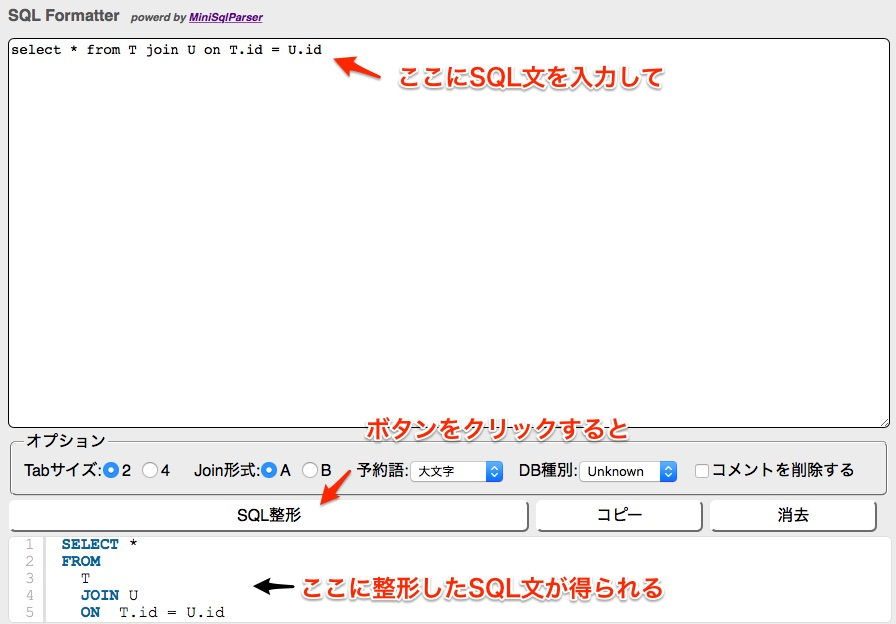

# miniSqlParser
a simple SQL Parser, that can convert sql statements to an abstract syntax tree.

## Description
C#で作成したシンプルなSQL構文解析器です。SQL文を解析して構文木を生成します。SELECT・INSERT・UPDATE・DELETEなどの基本的なSQL文に対応しています。生成した構文木をから整形したSQL文を出力したり、SQL文の変更などなどを行うことができます。

miniSqlParserは.NETのアセンブリファイル(DLLファイル)です。C#などの.NET言語から参照して使用します。

SQL文の文法はDBMSによりかなり異なるため、主要DBMSの文法から共通的、かつ一般に用いられている部分を抜き出した文法を解析対象としています。

## Demo
[ここ](http://www.minisqlparser.net/ "SQL Formatter")で公開しているSQL整形WebアプリでminiSqlParserを使用しています。

## Usage
    // SQL文の文字列から構文木(Abstract Syntax Tree)を出力します
    var ast = MiniSqlParserAST.CreateStmts("SELECT col FROM TBL");

    // 構文木から整形SQL文を出力するVisitorを生成します
    // このように構文木を走査するVisitorを用意できれば様々な処理を構文木に対して行えます
    // (BeautifulStringifierクラスはminiSqlParserにサンプルとして含めています)
    var stringifier = new BeautifulStringifier(4098);

    // Visitorに構文木を走査させます
    ast.Accept(stringifier);

    // 操作し終えたVisitorから結果(整形後のSQL文)を取得します
    string formattedSql = stringifier.ToString();

## Requirement
* Antlr4.Runtime.Standard 4.7.1
* .NET Framework 2.0 以上

## Licence
[MIT](https://github.com/tcnksm/tool/blob/master/LICENCE)
